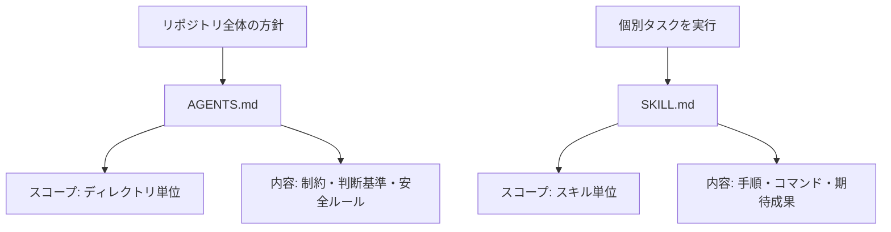
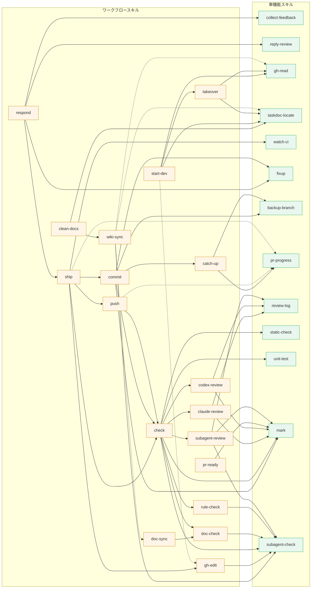

# bonsai

開発で使っている、比較的汎用的なSKILLをまとめて育てていくリポジトリです。

このリポジトリのテキストファイルは、UTF-8 と LF 改行を既定として扱います。

## SKILL is 何？

SKILL.mdは、コーディングエージェントに「この流れで進めてね」と伝えるための手順書です。

コーディングエージェントの活用が広がり始めたごく初期には、各エージェントごとに形式がばらばらでみんな手探りで運用していました。最近は `AGENTS.md + SKILL.md` という形に寄ってきていて、だいぶ扱いやすくなってきた印象です。

### 参考リンク

- [Agent Skills公式](https://agentskills.io/home)
- [AGENTS.md公式](https://agents.md/)

## AGENTS.mdとSKILL.mdの違い

ざっくり言うと、`AGENTS.md` は「このディレクトリで守るルール」、`SKILL.md` は「特定タスクの進め方」です。



| 項目         | AGENTS.md                            | SKILL.md                    |
| ------------ | ------------------------------------ | --------------------------- |
| 主な役割     | ガードレールを定義                   | 実行手順を定義              |
| 読まれる場面 | そのディレクトリ配下で作業するとき   | そのスキルを呼び出したとき  |
| 置き場所     | リポジトリルートや各サブディレクトリ | 各スキルディレクトリ        |
| 例           | 「秘匿情報を含めない」               | 「Issueを作成してPRを作る」 |

普段の開発はClaude Codeをメインに、Codexをサブで使っています。

Claude CodeではSKILLをカスタムコマンドのように読み込ませる使い方もできますが、このリポジトリのSKILL.mdは、特定エージェントに依存しないプレーンな形で書くようにしています。

## Skills

| スキル                                                 | 概要                                            |
| ------------------------------------------------------ | ----------------------------------------------- |
| [approve](./skills/approve/SKILL.md)                   | エージェント提案への承認内容の整理              |
| [backup-branch](./skills/backup-branch/SKILL.md)       | autosquash や大きな履歴編集前の退避ブランチ作成 |
| [catch-up](./skills/catch-up/SKILL.md)                 | main 取り込みと rebase 後の確認                 |
| [check](./skills/check/SKILL.md)                       | 品質チェックの一連実行                          |
| [claude-review](./skills/claude-review/SKILL.md)       | Claude CLIによるコードレビュー                  |
| [clean-docs](./skills/clean-docs/SKILL.md)             | `.claude/docs` のタスクドキュメント整理         |
| [collect-feedback](./skills/collect-feedback/SKILL.md) | 変更内容に対するフィードバック収集と整理        |
| [codex-review](./skills/codex-review/SKILL.md)         | codex CLIによるコードレビュー                   |
| [commit](./skills/commit/SKILL.md)                     | gitコミット（段階的コミット、fixup、amend）     |
| [d](./skills/d/SKILL.md)                               | 企画・開発相談の論点整理                        |
| [doc-check](./skills/doc-check/SKILL.md)               | ドキュメント整合性・説明品質の確認              |
| [doc-sync](./skills/doc-sync/SKILL.md)                 | ドキュメント整合性の修正                        |
| [fixup](./skills/fixup/SKILL.md)                       | 既存コミットへの fixup 追加                     |
| [gh-edit](./skills/gh-edit/SKILL.md)                   | GitHub PR/Issueの作成・更新                     |
| [gh-read](./skills/gh-read/SKILL.md)                   | GitHub Issue/PR の参照と要約                    |
| [issue-review](./skills/issue-review/SKILL.md)         | Issue とコードベースの照合・有効性判定          |
| [link-agentdoc](./skills/link-agentdoc/SKILL.md)       | AGENTS / CLAUDE への参照ドキュメント導線追加    |
| [link-skills](./skills/link-skills/SKILL.md)           | Codex / Claude 向けスキルリンク作成             |
| [mark](./skills/mark/SKILL.md)                         | チェック済み状態のタグ設置                      |
| [monthly-report](./skills/monthly-report/SKILL.md)     | GitHub 活動データからの月次報告作成             |
| [diff-comment](./skills/diff-comment/SKILL.md)         | PR 差分行への意図説明コメント投稿               |
| [pr-ready](./skills/pr-ready/SKILL.md)                 | PR のレビュー準備確認と Ready 化                |
| [pr-progress](./skills/pr-progress/SKILL.md)           | PR 進捗コメントの整形・更新                     |
| [push](./skills/push/SKILL.md)                         | push 前確認と push 実行                         |
| [q](./skills/q/SKILL.md)                               | 変更せず前提・経緯・現状への質問に回答          |
| [r](./skills/r/SKILL.md)                               | 指定資料の読み直しと理解更新                    |
| [reply-review](./skills/reply-review/SKILL.md)         | レビューコメントへの返信支援                    |
| [revise](./skills/revise/SKILL.md)                     | エージェント提案の再検討点の整理                |
| [review-log](./skills/review-log/SKILL.md)             | review 指摘と判断の一時ログ管理                 |
| [review-reminders](./skills/review-reminders/SKILL.md) | 自分の Open PR のレビューリマインド候補整理     |
| [respond](./skills/respond/SKILL.md)                   | 指摘対応から返信までのワークフロー              |
| [rule-check](./skills/rule-check/SKILL.md)             | AGENTS / CLAUDE ルールへの適合確認              |
| [ship](./skills/ship/SKILL.md)                         | check から PR 更新までの出荷フロー              |
| [start-dev](./skills/start-dev/SKILL.md)               | 作業開始時のブランチ準備と情報収集              |
| [static-check](./skills/static-check/SKILL.md)         | リポジトリの lint・build の検出と実行           |
| [subagent-check](./skills/subagent-check/SKILL.md)     | サブエージェント起動前の状態確認                |
| [subagent-review](./skills/subagent-review/SKILL.md)   | サブエージェントによる差分レビュー（commit 時） |
| [takeover](./skills/takeover/SKILL.md)                 | 前セッションのコンテキスト収集と作業引き継ぎ    |
| [tanaoroshi](./skills/tanaoroshi/SKILL.md)             | 複数リポジトリの Issue/PR 棚卸し                |
| [taskdoc-locate](./skills/taskdoc-locate/SKILL.md)     | タスクドキュメント配置先の場所解決              |
| [unit-test](./skills/unit-test/SKILL.md)               | リポジトリのユニットテストの検出と実行          |
| [watch-ci](./skills/watch-ci/SKILL.md)                 | CI 状態の監視と失敗時の確認                     |
| [wiki-sync](./skills/wiki-sync/SKILL.md)               | 開発内容から LLM Wiki への知識同期              |
| [writing-check](./skills/writing-check/SKILL.md)       | エージェントが書いた文面の品質確認              |

`approve` は提案どおり進めてよい範囲を整理し、`revise` は条件追加や差し戻しとして再検討が必要な部分を整理します。条件付き承認は `revise` で扱います。1 つの応答に、承認済みの部分と再検討が必要な部分が明確に混在する場合は、1 つのスキルで完結させず、呼び出し側が承認部分と再検討部分を分けて個別に扱います。

リポジトリ専用の保守スキルは `internal/` で管理しています。

| スキル                                             | 概要                                                    |
| -------------------------------------------------- | ------------------------------------------------------- |
| [config-export](./internal/config-export/SKILL.md) | ローカルのグローバル設定から公開用サンプルへ反映する    |
| [config-import](./internal/config-import/SKILL.md) | 公開用サンプルからローカルのグローバル設定へ merge する |
| [daily-tagging](./internal/daily-tagging/SKILL.md) | 日別の最終コミットへ `daily-YYYY-MM-DD` タグを付与する  |

### GitHub コメント系スキルの使い分け

GitHub 上にコメントを残す操作は、コメントの置き場所と目的で使い分けます。

| 場面                                              | 使うスキル          |
| ------------------------------------------------- | ------------------- |
| PR diff の特定行にレビュー時だけ必要な意図を置く  | `/diff-comment`     |
| PR トップレベルに進捗や force push 後の経過を書く | `/pr-progress`      |
| 既存レビューコメントのスレッドへ返信する          | `/reply-review`     |
| PR/Issue のタイトル・概要欄を作成または更新する   | `/gh-edit`          |
| PR/Issue のコメントやレビュー内容を収集する       | `/collect-feedback` |

## スキル間の依存関係

各スキルが他のどのスキルへ処理を委譲しているかを示します。層で色分けし、実線は通常フローで実行される委譲、点線は条件付きで実行される委譲です。停止後に次に使うスキルとして報告するだけの案内や、単なる関連スキルの使い分け案内は図の対象外です。

委譲関係を持つワークフロースキルと、それらから呼び出される単機能スキルを以下に示します。



層の凡例:

| 層                 | 説明                                                                 |
| ------------------ | -------------------------------------------------------------------- |
| 単機能スキル       | 他スキルへ委譲せず、自身の操作だけで責務を完結する                   |
| ワークフロースキル | 他スキルへ委譲する。固有操作を持つものと委譲の連結が主体のものを含む |

## Setup

エージェントによっては、AGENTS.mdやSKILL.mdをリポジトリに置いただけでは、デフォルトで読んでくれないことがあります。

たとえば Claude Code では `CLAUDE.md` と `~/.claude/skills`、Codex では `AGENTS.md` と `~/.codex/skills` を使います。こういうときはリンクでつなぐのが手軽です。

公開スキルは `skills/` 配下にあり、リンク対象はこのディレクトリです。`archive/`（退役スキル）・`internal/`（リポジトリ専用スキル）はリンク対象外です。

このリポジトリで管理する補助スクリプトは `tools/` に集約しています。スキルから `mark.sh` や `tanaoroshi` などを使うため、`tools/` を PATH に追加してください。

```bash
export PATH="/path/to/bonsai/tools:$PATH"
```

### Windows で Codex を使う場合

`~/.codex/skills` 配下に、`skills/` 内の各スキルディレクトリへのジャンクションを作成します。

例:

```bash
mklink /J %USERPROFILE%\.codex\skills\commit C:\path\to\bonsai\skills\commit
```

### macOS / Linux で Claude Code を使う場合

`skills/` ディレクトリを `~/.claude/skills` へリンクする運用ができます。

例:

```bash
ln -s /path/to/bonsai/skills ~/.claude/skills
```

### 推奨設定: スキルの前提条件を別スキルで解決する

ここで管理するスキルは、他スキルを前提に組み立てられているものがあります（例: `push` は `check` の通過を前提とし、`commit` は各コミット末尾で `check` を呼ぶ）。あるスキルの前提条件が満たされていないとき、その前提を満たせる別のスキルがあるなら先にそれを実行してから元のスキルに戻る、という挙動をエージェントの恒久設定に入れておくと、ワークフローが途中で止まらず連鎖して解決されます。

Claude Code を使う場合は、`~/.claude`（CLAUDE.md や `rules/` 配下）に次のような指示を追記しておくことを推奨します。

> ある skill を実行する上での前提条件が満たされていない場合、その前提条件を満たせる別の skill が存在するなら、先にその skill を実行して前提を満たしてから元の skill を実行する。連鎖する前提も同様に遡って解決する。

他のエージェントを使う場合も、それぞれの恒久設定ファイル（Codex なら `AGENTS.md` など）に同趣旨の指示を入れておくと同じ挙動が得られます。

グローバル設定へ入れている運用ルールのサンプルは [examples/codex](./examples/codex/README.md) と [examples/claude](./examples/claude/README.md) に置いています。実際にこのリポジトリへ適用される設定ではなく、自分の環境へ移す前提の公開用サンプルです。両者とも、単一リポジトリ内のドキュメントで責務を分け、重複を避け、どの文書を基準にするかを決める方針を含みます。
